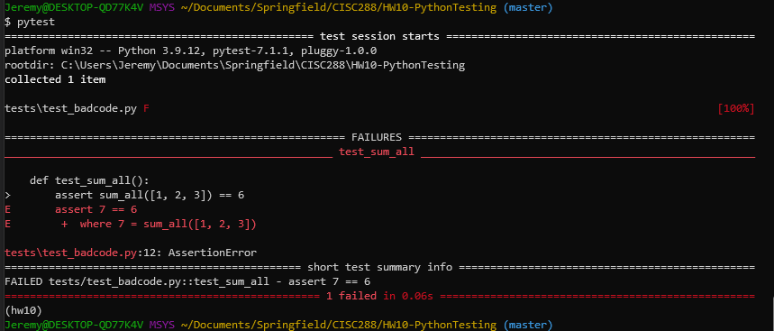
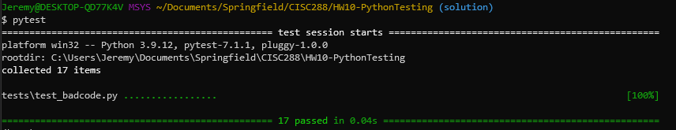

PythonTesting

You have just been hired as a software engineer at a small startup. The company is looking for a talented software engineer to join their team. You are that person! Your boss's first task is to fix **bugs** in the `badcode` module: a collection of small functions.

You have been asked to write a **test suite** for the `badcode` module to help expose all the bugs by showing test failures. **After** exposing the bugs you should try and fix any errors. Follow the steps below to get started.

## Part 1 (4 points)

1. Create a conda virtual environment called "hw10": `conda create -n hw10 python=3.9`
2. Activate the virtual environment: `conda activate hw10`
3. Install the `badcode` package in "development mode": `pip install -e .`
4. Run the tests: `pytest -v`. You should get output like this:




This is showing that there were test failures! I have already written one test for you and it is showing that there are bugs in the `badcode` module. You should be seeing red until you fix the bugs, which you will do in Part 3. Take a screen shot of this output and save it as `part1-2.png` in the `imgs` directory. This is to prove that you successfully completed part 1.

## Part 2 - Write tests and show failures (7 points)

1. Look at the `badcode` module and find the `__init__.py` file. This file has all the functions you need to write tests for. To know what the function is supposed to do, read the "docstring", which is the text that appears just below the function definition.

For example the `badcode.sum_all` function has function and docstring:

```python
def sum_all(numbers):
    """
    Add together all the numbers in a list.

    :param numbers: A list of numbers.
    :return: The sum of all the numbers in the list.
    """
    total = 1
    for number in numbers:
        total += number
    return total

```

You can see that the text explains what the function does. `numbers` should be a list of numbers and this function adds them all together and returns the total.

2. Tests are written in `tests/test_badcode.py` file. Look at the test for the `badcode.sum_all` function that is inside `tests/test_badcode.py` file. It should be called `test_sum_all`.

Remember that a test is a function that starts with `test_`. Here is an example one already created for you. Here is the test for `badcode.sum_all` function:

```python
def test_sum_all():
    assert sum_all([1, 2, 3]) == 6
```

Remember that you can also use `pytest.mark.parameterize` decorate to test different inputs. Here is an example of the `@pytest.mark.parametrize` decorator to test different inputs.
```python
@pytest.mark.parametrize("numbers, expected", [
    ([1, 2, 3], 6),
    ([1, 2, 3, 4], 10),
    ([1, 2, 3, 4, 5], 15),
])
def test_sum_all(numbers, expected):
    assert sum_all(numbers) == expected
```


3. Write a test/tests for `badcode.multiply_all`. You need a minimum of one test.

4. Write a test/tests for `badcode.count_characters`. You need a minimum of one test.

5. Write a test/tests for `badcode.count_words`. You need a minimum of one test.

6. Write a test/tests for `badcode.count_lines`. You need a minimum of one test.

7. Write a test/tests for `badcode.greet`. You need a minimum of one test.

8. Write a test/tests for `badcode.check_is_palindrome`. You need a minimum of one test.

9. Run all your tests: `pytest`. You should get an output of your tests *similar* to this:

```
.....MORE CODE ABOVE .......
string = 'roger', expected = False

    @pytest.mark.parametrize("string, expected", [
        ("roger", False),
        ("racecar", True),
        ("madam", True)
    ])
    def test_palindrome(string, expected):
>       assert(check_is_palindrome(string) == expected)
E       AssertionError: assert True == False
E        +  where True = check_is_palindrome('roger')

tests\test_badcode.py:67: AssertionError
=============================================== short test summary info ===============================================
FAILED tests/test_badcode.py::test_sum_all - assert 7 == 6
FAILED tests/test_badcode.py::test_multiply_all[numbers1-24] - assert 0 == 24
FAILED tests/test_badcode.py::test_count_characters[hello-l-2] - AssertionError: assert None == 2
FAILED tests/test_badcode.py::test_count_characters[hello-o-1] - AssertionError: assert None == 1
FAILED tests/test_badcode.py::test_count_characters[hello-g-0] - AssertionError: assert None == 0
FAILED tests/test_badcode.py::test_count_words[hello im hungry\nHow about you?-2] - AssertionError: assert 0 == 2
FAILED tests/test_badcode.py::test_count_words[hello-1] - AssertionError: assert 0 == 1
FAILED tests/test_badcode.py::test_count_words[hello you\nare\nthere-3] - AssertionError: assert 0 == 3
FAILED tests/test_badcode.py::test_greet[Jeremy-Hello, Jeremy!] - AssertionError: assert 'HelloJeremy' == 'Hello, Jer...

FAILED tests/test_badcode.py::test_greet[Roger-Hello, Roger!] - AssertionError: assert 'HelloRoger' == 'Hello, Roger!'
FAILED tests/test_badcode.py::test_palindrome[roger-False] - AssertionError: assert True == False
============================================ 11 failed, 3 passed in 0.14s =============================================
```
Basically, a bunch of failed tests (maybe some passing). We have now written tests for all the functions in `badcode` module. Now lets fix them in the next section.


## Part 3 - Fix bugs! (7 points)

Now fix all the bugs that were in the functions and discovered by your tests. You can do this by editing the `badcode/__init__.py` file and fixing each function one by one. After you have fixed a bug in **one** function, you should see if the test pass when you run `pytest -v`. It will show passing tests first and then failing tests so you may need to scroll up. If it passes, you are done with that function. If it fails, you should try to fix the bug again in that function and then run `pytest -v` again.

You have a total of **seven** functions to fix. After you fix your functions, run `pytest -v` again and you should get this:



In this example I wrote 17 different tests for all 7 functions. They all passed, I fixed the bugs! Remember, you only need a minimum of one test for each function (7 total).

# Resources 

Here is a list of resources that may be helpful.

* https://bas.codes/posts/python-pytest-introduction
* https://raphael.codes/blog/customizing-your-pytest-test-suite-part-1/

